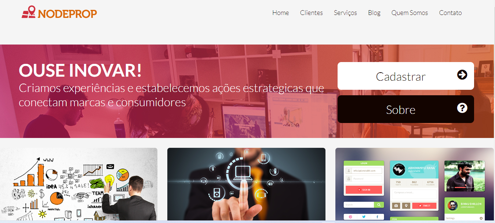
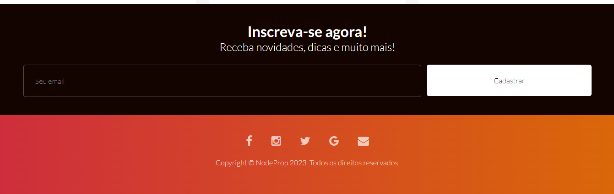
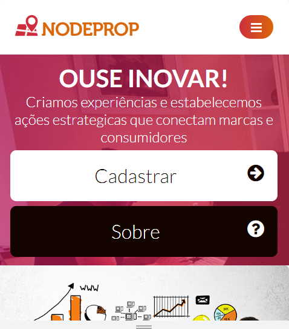

# NodeProp

Landing Page para praticar tecnologias como HTML, CSS, JavaScript e técnicas de responsividade, como Mobile First e Design Fluido.

 

Link:

## Minha aplicação:

## Tecnologias utilizadas:

<ul>

  <li>Design Responsivo</li>

  <li>JavaScript</li>

  <li>HTML</li>

  <li>CSS</li>

</ul>

## Sobre a aplicação:

Essa aplicação é uma Landing Page elaborada usada o conceito de Mobile First e Design Fluido, ela se adequa a dispositivos mobile, Tablet e Desktop.

## Ficaria feliz com Feedbacks:

Email: raphaeldesousalm@gmail.com  

LinkedIn: https://www.linkedin.com/in/raphaellima98/
