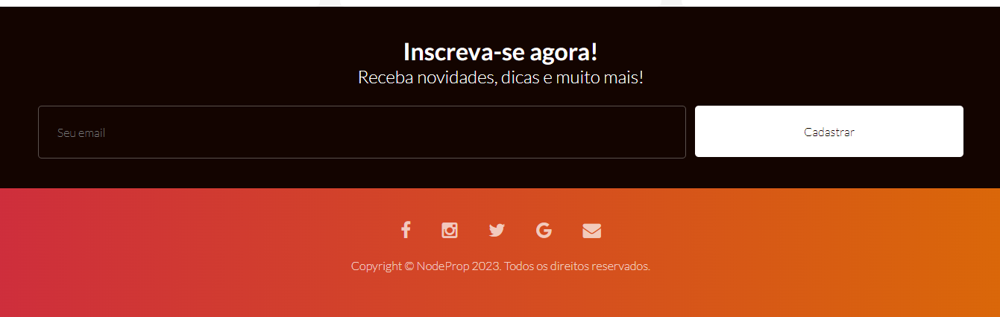

# design-responsive-nodeProp 

  

Site desenvolvido para uma agência de publicidade usando os conceitos de Mobile First e Design Fluido 

  

Link:  

  

  

## Minha aplicação:   

  

  

  

  

  

  

  

  

  

  

## Tecnologias e Métodos utilizados:   

  

<ul>   

  

  <li>Mobile First</li>   

  

  <li>Design Fluido</li>   

  

  <li>JavaScript</li>   

  

  <li>HTML</li>   

  

  <li>CSS</li>   

  

</ul>   

  

## Sobre a aplicação:   

  

Para praticar meus conhecimentos de design responsivo, desenvolvi um site para uma agência de publicidade, nele foram usadas as técnicas de desenvolvimento mobile first e design fluido. Esse site se adequa perfeitamente para dispositivos moveis, tablets e desktops.  

  

Email: raphaeldesousalm@gmail.com     

  

Linkdin: https://www.linkedin.com/in/raphaellima98/  
